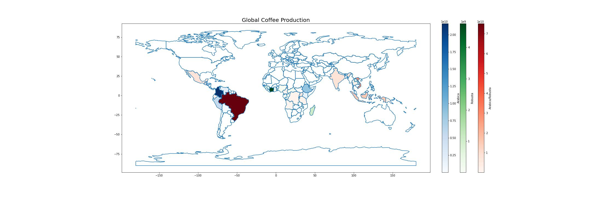
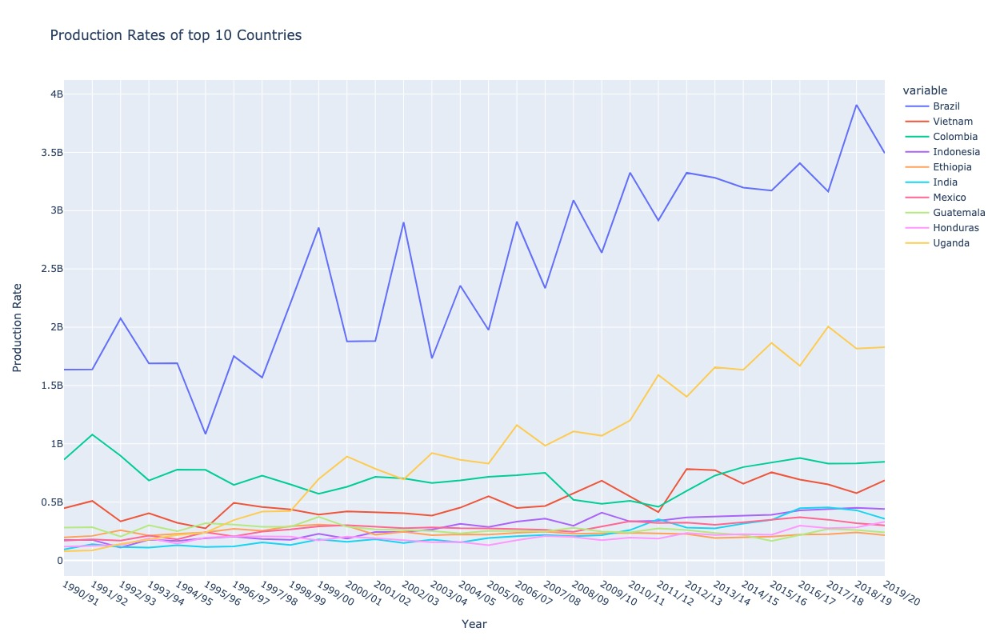

# Project of Data Visualization (COM-480)

| Student's name | SCIPER |
| -------------- | ------ |
| Fan Nie | 366936 |
| Yikai Zhang | 366940 |
| Kamila Babayeva| 342448 |

[Milestone 1](#milestone-1) • [Milestone 2](#milestone-2) • [Milestone 3](#milestone-3)

## Milestone 1 (23rd April, 5pm)

**10% of the final grade**

This is a preliminary milestone to let you set up goals for your final project and assess the feasibility of your ideas.

### Dataset

For our project we use two datasets: (1) scraped data from the website [Kofio](https://www.kofio.co/), (2) Kaggle [Coffee Dataset](https://www.kaggle.com/datasets/michals22/coffee-dataset), (3) collected data about [Coffee-Food-Pairing](https://www.homegrounds.co/coffee-food-pairing/).

**Kofio Dataset.** We scraped the necessary data from [Kofio](https://www.kofio.co/) because we couldn't find a suitable dataset that met our requirements regarding coffee flavors, brewing methods, and brands. Kofio offers a wide range of coffee products from various European brands. All of the coffee products on Kofio have the same set of information, as an example:

| Key | Value |
| --- | --- |
| Item Name: | EASTER FILTER blend - Easter limited edition |
| Roast Date: | 27.03.2023 (8 days) |
| Roastery: | Square Mile |
| Coffee Origin: | Kenya specialty coffee Kenya, Peru specialty coffee Peru |
| Region: | Kirinyaga |
| Variety: | Caturra |
| Roast Type: | Filter |
| Process: | Washed |
| Flavour Profile: | Apple blossom, Cherry pie |
| Roast Level: | Light to Medium Light |
| Brewing Method: | French Press, Hario V60, Vacuum Pot |
| Rating: | 4.4 |
| Recommended: | 93% |
| Price: | 19,99 |

Although each coffee product has exactly the same keys, some of the values for certain keys are null, thus requiring missing value treatment. Besides, the Price variable should be of float type instead of string with comma, so we convert them to float. All of these are done in Python.

**Coffee dataset.** We use the [Coffee Dataset](https://www.kaggle.com/datasets/michals22/coffee-dataset) to display the global production and consumption of coffee. This dataset provides information on the amount of coffee export, import and consumption by countries from 1990 to 2019. During the analysis, we discovered that some of the values representing the number of kilograms were less than 0. This issue occurred due to an overflow error that occurred during some calculations. To resolve this issue, we used the original [Python notebooks](https://github.com/MSI17819/Coffee_data_analysis/blob/main/Coffee_codeimpro.ipynb) to fetch the data, perform the necessary calculations while taking into account the possibility of overflow, and saved the updated dataset.

**Pairing dataset.** We collected the data about how to pair coffee with data from [homegrounds](https://www.homegrounds.co/coffee-food-pairing/) The dataset we collected has three columns: Coffee origin, Food and Flavor type. For example:

| Coffee origin | Food | Flavor type |
| --- | --- | --- |
| Yemen | Blueberries | Fruity |
| Columbia | white chocolate | Chocolate |

The dataset is clean and needn't to be preprocessed.

### Problematic
Originating from the mysterious land of the Kingdom of Kaffa in Eutopia, coffee has evolved into much more than a tasty and healthy beverage. It has transcended into a cultural symbol, a social ritual, a source of comfort, and a muse for inspiration. Across the globe, coffee shops have transformed into meeting places for friends, colleagues, and neighbors, fostering a sense of community. Additionally, coffee production is a significant economic driver in numerous societies, offering income and employment opportunities to small-scale farmers and large-scale plantations. 

Recognizing coffee's prestige, our project Kingdom of Kaffa provides a comprehensive overview of coffee's impact, including its various origins, flavors, and brewing techniques. Our website also serves as a platform for users to find their ideal and real European coffee brand, facilitating their immersion into the coffee community. Our website caters to coffee enthusiasts and beginners, allowing everyone to find their perfect cup of coffee.

To meet the goals describe above, our website will roughly (might change sligthly overtime) contain the following visualizations:

**Figure 1:** This map displays the production and consumption levels of coffee on a country level over the years. Through this visualization, users can see how the demand for coffee has changed, the global distribution of coffee plantations, and the countries with the highest consumption rates.

**Figure 2:** This graph illustrates the prices and ratings of various European coffee brands. Users can easily compare the data and select the best brand according to their preferences.

**Figure 3:** This bubble-cluster visualization provides filtering options based on flavor, brewing method, and roast level. Users can input their preferences, and the visualization will output the coffee that best aligns with their taste.

### Exploratory Data Analysis

<!-- > Pre-processing of the data set you chose
> - Show some basic statistics and get insights about the data -->

#### Coffee dataset analysis
We will be using the Coffee dataset to create a visualization (Figure 1) of global coffee consumption and production on a world map. The Coffee dataset includes seven files containing data on coffee import and export, but we will be focusing on the following three files:

> - Coffee_domestic_consumption.csv
> - Coffee_import_consumption.csv
> - Coffee_production.csv 

**Global consumption.** To achieve our goal of visualizing global consumption, we combined two files - Coffee_domestic_consumption.csv and Coffee_import_consumption.csv - into one file called Coffee_total_consumption.csv. To visualize the map, we used the [geopandas](https://geopandas.org/en/stable/) library. However, the country names in our dataset had to be renamed to match the names in the geopandas library.

**Global production.** To visualize global production, we used the Coffee_production.csv file. Again, we used the geopandas library to create the map, but we had to rename the country names in our dataset to match those in the geopandas library. The clean dataset is saved in Coffee_production_clean.csv.

The figure below displays global coffee consumption with respect to the type of coffee and production rate. The two types of coffee - Arabica and Robusta - are produced in countries located in Central and South America, Western, Eastern, and Central Africa, and South and Southeast Asia. Some countries produce both types of coffee. Brazil is the largest producer of Arabica and Robusta, Colombia is the biggest producer of Robusta, and Côte d'Ivoire is the largest producer of Arabica.

The figure below provides a closer look at the top 10 coffee-producing countries from 1990 to 2020. Brazil, Uganda, and Colombia are the biggest producers, and there has been a positive trend in their production over the years, which may indicate an increasing demand for coffee.

Note: This last visualisation was taken from [Coffee - Extensive EDA](https://www.kaggle.com/code/akhiljethwa/coffee-extensive-eda).

#### Kofio dataset analysis
We will be using the Kofio dataset we scraped to create visualizations (Figure 2,3,4) about the typical coffee products. Detailed analysis can be found in the [jupyter notebook](https://github.com/com-480-data-visualization/project-2023-kingdom_of_kaffa/blob/master/dataset_analysis/kofio_da.ipynb)
<!-- To be continued -->

#### Pairing dataset analysis
We analyze the pairing dataset using [jupyter notebook](https://github.com/com-480-data-visualization/project-2023-kingdom_of_kaffa/blob/master/dataset_analysis/pairing_da.ipynb).

There're 83 different entries in the dataset. Among them, total numbers of coffee origins, foods and flavor types are 25,23 and 8. The coffee origins can be seen as coffee types. And we group the data by origins and flavor types to see the origin-flavor, origin-food, food-flavor pairings.

The figure below presents a clear look at the origin-flavor pairings.

<!-- To be continued -->

### Related work

> - What others have already done with the data?
> - Why is your approach original?
> - What source of inspiration do you take? Visualizations that you found on other websites or magazines (might be unrelated to your data).

Since the Kofio Dataset is scraped by us, nobody has done with this dataset. However, several works have conducted data analysis and visualization on the Coffee dataset.
* [Coffee Economic EDA](https://www.kaggle.com/code/ayaabdalsalam/coffee-economic-eda) tabulates the total coffee consumption for 55 countries and subsequently displays the resulting data in a histogram format. The histogram portrays the consumption of each country in a descending order. Besides, it analyzes the mean, median and total consumption from 1990 to 2020 and the coffee type of each country.
* [Coffee - Extensive EDA](https://www.kaggle.com/code/akhiljethwa/coffee-extensive-eda) examines different aspects of the Coffee dataset, such as global coffee production and consumption, the top coffee-producing countries, the different types of coffee produced, and the top coffee importers and exporters. The analysis also includes a comparison of coffee production and consumption trends over the years. The resultant data was subsequently represented using line and bar charts.
* [Simple EDA](https://www.kaggle.com/code/sabinorsp/simple-eda-for-this-dataset/notebook), [Data Visualization of the Coffee Dataset](https://www.kaggle.com/code/aaronjones32/data-visualisation-of-the-coffee-dataset) produce similar analysis as the work above.

<!-- * [Simple EDA](https://www.kaggle.com/code/sabinorsp/simple-eda-for-this-dataset/notebook) presents the visualizations of the top 10 coffee exporting and importing countries, along with the leading coffee producers and domestic consumers. Furthermore, it assesses the yearly coffee production of the key countries and employs a line chart to depict the trend.
* [Data Visualization of the Coffee Dataset](https://www.kaggle.com/code/aaronjones32/data-visualisation-of-the-coffee-dataset) delved into the top countries concerning coffee export, import, domestic consumption, and production, along with the coffee consumption trends of the importing nations. The resultant data was subsequently represented using line charts, spanning the timeline from 1990 to 2020. -->

Our approach is original due to the following aspects:
* We analyze the existing coffee brands and consider the rich coffee flavours.
* Our visualisation can help visitors to buy an existing coffee they love.

Also, several great visualizations from other topics have inspired us to come up with our ideas.
* [Covid-19 in Switzerland](https://com-480-data-visualization.github.io/com-480-project-lcelo/website/). The SWITZERLAND MAP visualization inspired us to come up with our Figure 1. We want to visualize the change of coffee consumption, import volume and export volumn according to years and countries in a way which shows the growing popularity of coffee.
* [Wine101](https://com-480-data-visualization.github.io/com-480-project-onvagagner/website/index.html). The cluster visualization inspired us to show clusters based on flavor, brewing method, and roast level.
* [Coffee Flavor Wheel](https://www.webstaurantstore.com/blog/3824/coffee-pairings.html). This coffee flavor wheel inspired us to show the coffee-flavor, coffee-food or flavor-food pairings.

## Milestone 2 (7th May, 5pm)

**10% of the final grade**

## Milestone 3 (4th June, 5pm)

**80% of the final grade**

## Late policy

- < 24h: 80% of the grade for the milestone
- < 48h: 70% of the grade for the milestone

