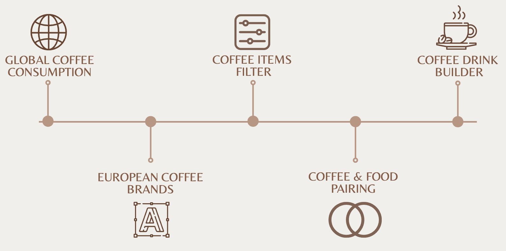

#  Coffee Kingdom 

Project of Data Visualization COM-480

| Student's name  | SCIPER |
| --------------- | ------ |
| Fan Nie         | 366936 |
| Yikai Zhang     | 366940 |
| Kamila Babayeva | 342448 |

[Milestone 1](milestones/milestone1.md) • [Milestone 2](milestones/milestone2.md) • [Milestone 3](Process%20Book.pdf)

`Side note: our name has evolved from Kingdom of Kaffa to Coffee Kingdom. We found our new name catchy and easier to pronounce.`

# Abstract
**Coffee Kingdom** is the ultimate destination for coffee lovers and newcomers alike. Whether you're new to coffee or a passionate enthusiast, we're here to assist you in finding the perfect package of freshly roasted coffee near you. Explore European roasteries and their exceptional products while expanding your understanding of coffee influences and delightful coffee beverages available.



- The process book is available [here](Process%20Book.pdf)
- The screencast of the website is available [here] (futurelink)
- Visit our website at [Coffee Kingdom](https://com-480-data-visualization.github.io/project-2023-kingdom_of_kaffa)

# Technical set
Our website is available online at [Coffee Kingdom](https://com-480-data-visualization.github.io/project-2023-kingdom_of_kaffa).

If you would like to run the website locally, you can clone this repository via:
```
git clone https://github.com/com-480-data-visualization/project-2023-kingdom_of_kaffa.git
```
Open **./website/index.html** under the project folder with live server, and you can run the website locally.

# Intended Usage
Anyone who's interested in coffee or want to select some nice coffee items can use this website.

