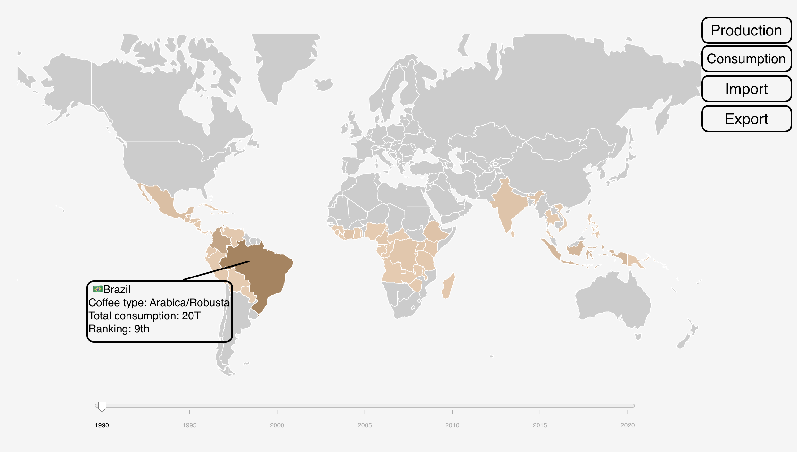

# Milestone 2

## Tools
**Website Hosting**: We will hosting our website using **Github Pages**.

**Website Structure**: To structure our project, we are using _[**fullpage.js**](https://alvarotrigo.com/fullPage/),_ which provides smooth and visually appealing transitions between sections. We are also utilizing _[**Bulma**](https://bulma.io/)_ plugin to make a clean layout of each section.

**Website Visual:** For theme colors of our website, we mainly resort to **_Lecture 6_**. We are also using different plugins such as _[**Bulma**](https://bulma.io/)_, _[**Fontawesome**](https://fontawesome.com/)_, and different fonts found online that allows a wide range of styling our components.

**Data Preparation**: For proper data visualization, we are using **_Pandas_** library to do the data cleaning part, which includes dealing with missing fields, deserting unwanted fields, and storing in CSV files. Afterward, we use **_d3.js_** to load the data from the CSV files into the JavaScript dictionary. **_Lecture 4_** is needed for the data loading part.

**Data Visualization**: Our primary tool for data visualization is **_d3.js_**. We use it for detailed operations such as demonstrating data points and designing interactive features. **_Lecture 4_** and **_Lecture 5_** are mainly required for **_d3.js_**-related knowledge.

**Story Telling**: To improve our storytelling for this project, we plan to polish our text information according to **_Lecture 12_**.

## Project overview:
As required per Milestone two, we implemented the draft version of our website which you can visit here [Kingdom_of_kaffa](https://com-480-data-visualization.github.io/project-2023-kingdom_of_kaffa). In this section, we will display simple sketches of our core visualizations, their purpose and desired animation. Those sketches only display the idea of final result and will be improved towards the milestone 3.

### Figure 1
Coffee has evolved into more than just a drink, it's a representation of culture and tradition from around the world. Over the past few decades, the coffee market has seen significant changes due to the evolving coffee culture. Our interactive map visualization offers a unique way to display how the coffee market has changed over the years.
By playing with colors and their intensities, users can easily observe the changes in coffee production, consumption, import, and export in the chosen period of time. With the interactivity our map offers, the user can hover on different countries and retrieve detailed information such as country information, coffee type (Arabica/Robusta) and ranking among other producers/consumptors. Our website currently displays a world map that highlights the countries that produce coffee:

### Figure 2
Using **price-rate-recommendation** bubble chart, the user can identify the appropriate brand based on their budget and brand rating. The chart provides an overview of existing European brands and their prices, making it easier for users to choose the perfect coffee product.

Each bubble on the plot represents a unique coffee product and its color represents the brand. With the help of dropdown buttons, the user can interactively change x-axis, y-axis and the displayed brand. Users can interactively change the x-axis, y-axis, and displayed brand using the dropdown buttons. Hovering/clicking on a bubble highlights all the coffee products from the same brand, and detailed information about the brand is displayed on the right.

Below is the already implemented structure on the figure 2:

### Figure 3

Our bubble figure offers a magical filtering experience based on four distinct indicators: **Price**, **Flavor**, **Brewing Method**, and **Roast Method**. These mystical indicators were chosen not only because they are highly separable, but also because they are key factors that matter when selecting the perfect coffee product.

Behold! The screenshot of our draft version is shown below, and let us guide you through the enchanted functions our website offers 😆😆!!! Each circle represents a unique coffee product, and for each indicator, there's a **clickable button**. With each click, the colors of the circles transform according to the indicator's whimsical power!

But wait, there's more magic to be had! **Each circle itself is also enchanted and clickable**. This figure serves as a fancy filter for our users, and with each click of a specific color, only the circles that match the indicator's properties are left behind. In this way, users can continuously choose indicators and discover their perfect, fantastical coffee product!

You may be wondering where to know the details about you liked products, the right half is reserved for it! On the right hand side, the details about each coffee product will be introduced in detail.

### Figure 4

Coffee’s delightfully complex taste opens up a world of possibilities for great food pairings by following a few basic rules. Our Pairing figure shows **how to pair coffee with food** for visitors. It offers the pairing between **coffee origin** and **coffee flavor** as well as the **food flavor**. Each origin or flavor is represented by a clickable circle, and selecting a circle highlights relevant origins or flavors and displays detailed information on the right.

For a food flavor, information includes a description, the typical food and the coffee origins it goes well with. Similarly, for a coffee flavor, information includes a description, the typical coffee origins and the food it may goes well with. For coffee origins, information includes a description, possible flavors, and recommended food pairings.

## Project Breakdown

In this section, we describe the core visualization we'd love to demonstrate and extra ideas which can enhance the visualization first. Thus, the whole project is broken down into independent pieces to make it more manageable.

### Core Visualization

Since our ultimate purpose is to guide our users through a smooth journey on coffee product selection, our visualization will be revolved around **Figure 2** and **Figure 3**, which demonstrates clearly how each brand compares with each other in price, recommendation rate, and ratings. Sophisticated design and storytelling will be needed to make sure the best user experience. 

### Extra Ideas

**Figure 1** is a mesmerizing map that will transport you to a world of wonder and coffee bliss. With a wave of your hand, you can explore the global rise in coffee consumption and marvel at the countless coffee enthusiasts scattered across the globe. But beware, for once you start playing with this stunning visualization, you might want to stay in its captivating embrace.

Prepare to be dazzled by **Figure 4**, the ultimate reward for your coffee quest. With your selection of the finest coffee products complete, it's time to indulge in some well-deserved magic. This dazzling figure features an interactive pairing map that will take you on a journey of flavors and foods, carefully crafted to match the coffee of your dreams. So before you even lay your hands on your precious coffee, take a moment to let your imagination soar and envision the wondrous culinary creations that await you!

Again, we would try our best to implement the fanciest interactive effects and write the most charming stories! These would be both extra ideas.
